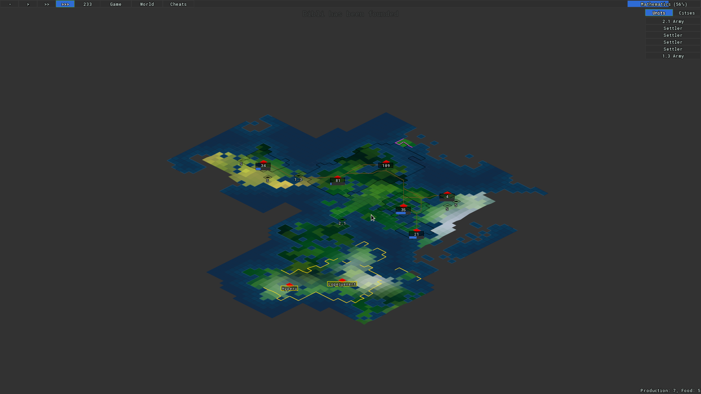
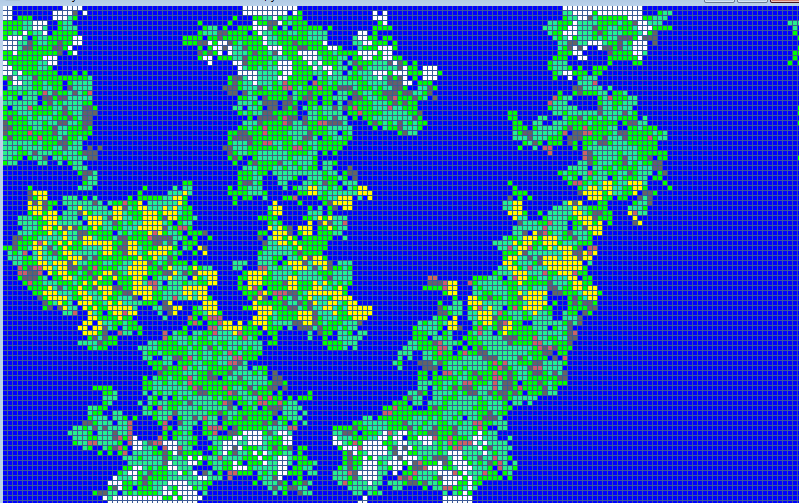

# Readme

This repository is a video game framework and monorepo for projects that I am building with said framework.

It's made entirely in C++, with the framework consisting mostly of a poorly built wrapper around [SFML](https://github.com/SFML/sfml) and a few other libraries. As I hope to have made clear [by the name](https://youtu.be/W78AGkm_AtE?t=58), with this repository comes a decision to start working out in the open. The intended end state is to sell each of these projects on Steam when they are nearing completion, but currently they are nowhere near so.

# Projects

I have three related projects planned. 

## It Usually Ends In Nuclear War

A 4x civilization building game with a focus on simplicity and reducing micromanagement. Guide a civilization from ancient times into the modern day, where things can get dicey. I think of it as a cross between Civilization II and Stellaris.

**Status**: Currently it consists of only map generation and drawing. I have working code for a much more complete version of this game, but I've stripped everything out and will be adding it back in system by system so that I can validate and change things as needed.

High level to do (roughly in order that I need to do it):
- [ ] bugs / refactoring
- [ ] nations
- [ ] vision
- [ ] cities
- [ ] units
- [ ] spawns
- [ ] unit movement
- [ ] resources
- [ ] econ system logic specified through json
- [ ] tiles assigned resource values
- [ ] map segmentation for city spawns
- [ ] city growth
- [ ] nation borders 
- [ ] city unit production 
- [ ] city resource generation
- [ ] name tags
- [ ] settlers
- [ ] explorers
- [ ] event modals (all choices here none in log)
- [ ] event log (ongoing pinned to top)
- [ ] technology
- [ ] buildings, point bars
- [ ] unit-unit battles
- [ ] unit-city battles
- [ ] unit water transitions
- [ ] first contact ui / vision
- [ ] diplomacy
- [ ] government
- [ ] unit cap
- [ ] admin cap
- [ ] nukes
- [ ] strategic resources
- [ ] barbarians
- [ ] crisis
- [ ] ai
- [ ] gui polish
- [ ] main menu
- [ ] options
- [ ] map generation menu

## It Didn't End In Nuclear War

A 4x galactic civilization building game with a focus on simplicity and reducing micromanagement. I think of it as 'it usually ends in nuclear war but in space'. It's going to share a lot of the same code and mechanics, but do so in a setting that I personally like more. To put it another way, it's something similar in spirit to Stellaris but without much of the tedium (why are there no templates for starbases for example?) and without the unplayable lag that always accompanies the Stellaris late game.

**Status**: I have some code for map generation, hyperlane systems, pathfinding, units, and ai. I have some thoughts for the art style but need to experiment to see if it works in practice. I'm still trying to figure out exactly what the design will be but I have a rough idea on how everything will work.

## It Always Ends In Nuclear War

Something akin to Conway's Game of Life but the simulation is modeling human history from hunter-gatherer to modern times. Ends when the inhabitants inevitably manage to blow themsleves up through nuclear war, the stupid bastards. I only have a vague sense of what this should be at the moment, but it should be very small in scope. For inspiration see [Gridworld](https://store.steampowered.com/app/396890/Gridworld/), [Gallimulator](https://store.steampowered.com/app/808100/Galimulator/), and [Empire by Hopson](https://github.com/Hopson97/Empire).

# Compiling

Everything is bundled with the exception of SFML. That will need to be installed (version 2.4 or greater) somewhere CMake can find it. In the scripts folder is a bash script to install SFML dependencies (but not SFML itself) on Debian derived distros.

By default cmake will build all of the projects. It Usually Ends In Nuclear War is currently the only runnable project.